# OpenSpartan Data Snapshots

A repository that contains map and game mode stats captured through the Halo Infinite API. The stats for each map and match are pulled every 45 minutes.

In every folder, as it relates to a particular map or game variant version, you will see two files:

- `metadata.json` - Contains the latest description of the asset for the specified version.
- `stats.tsv` - a tab-separated file that contains snapshots of stats captured through automated tasks in this repo.

## Maps

Every map folder has another (or many, likely in the future) folders representative of different map versions.

| Image | Map | Id | Available Versions |
|:----|:----|:----|:-------------------|
| 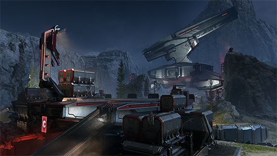           | `08607bf4-6abe-4a5b-9547-290a6cc1433e` | [Deadlock](https://github.com/dend/openspartan-data-snapshots/tree/main/data/maps/08607bf4-6abe-4a5b-9547-290a6cc1433e) | 1 |
| 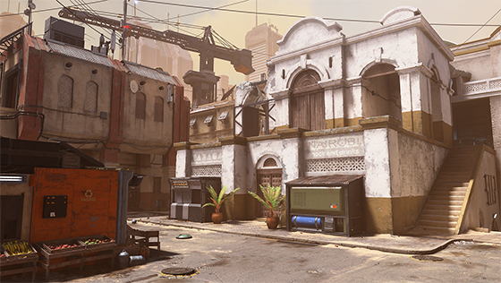               | `298d5036-cd43-47b3-a4bd-31e127566593` | [Bazaar](https://github.com/dend/openspartan-data-snapshots/tree/main/data/maps/298d5036-cd43-47b3-a4bd-31e127566593) | 1 |
| 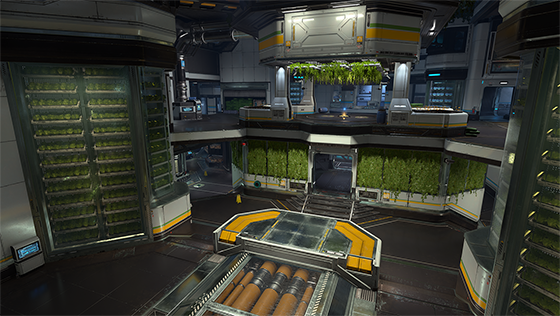           | `33c0766c-ef15-48f8-b298-34aba5bff3b4` | [Aquarius](https://github.com/dend/openspartan-data-snapshots/tree/main/data/maps/33c0766c-ef15-48f8-b298-34aba5bff3b4) | 1 |
| 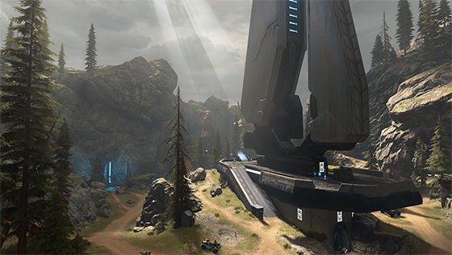 | `4f196016-0101-4844-8358-2504f7c44656` | [Fragmentation](https://github.com/dend/openspartan-data-snapshots/tree/main/data/maps/4f196016-0101-4844-8358-2504f7c44656) | 1 |
| 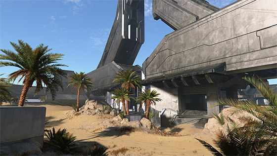           | `53136ad9-0fd6-4271-8752-31d114b9561e` | [Behemoth](https://github.com/dend/openspartan-data-snapshots/tree/main/data/maps/53136ad9-0fd6-4271-8752-31d114b9561e) | 1 |
| 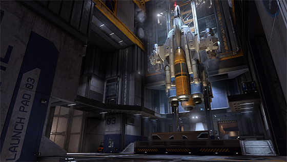     | `56a11b8c-64d1-4537-8893-a9241e4d5b93` | [Launch Site](https://github.com/dend/openspartan-data-snapshots/tree/main/data/maps/56a11b8c-64d1-4537-8893-a9241e4d5b93) | 1 |
| 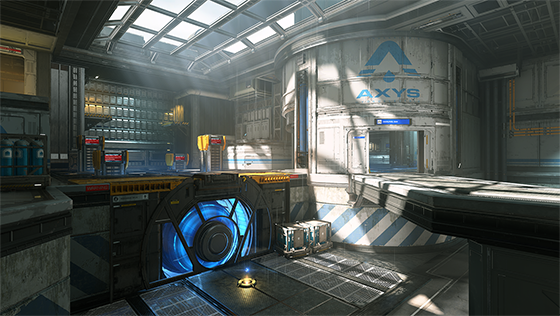           | `8420410b-044d-44d7-80b6-98a766c8c39f` | [Recharge](https://github.com/dend/openspartan-data-snapshots/tree/main/data/maps/8420410b-044d-44d7-80b6-98a766c8c39f) | 1 |
| 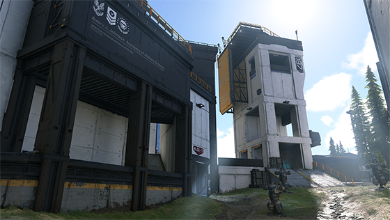         | `b6aca0c7-8ba7-4066-bf91-693571374c3c` | [Live Fire](https://github.com/dend/openspartan-data-snapshots/tree/main/data/maps/b6aca0c7-8ba7-4066-bf91-693571374c3c) | 1 |
| 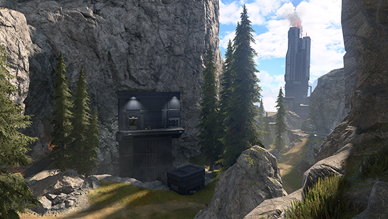         | `c494ef7c-d203-42a9-9c0f-b3f576334501` | [Highpower](https://github.com/dend/openspartan-data-snapshots/tree/main/data/maps/c494ef7c-d203-42a9-9c0f-b3f576334501) | 1 |
| 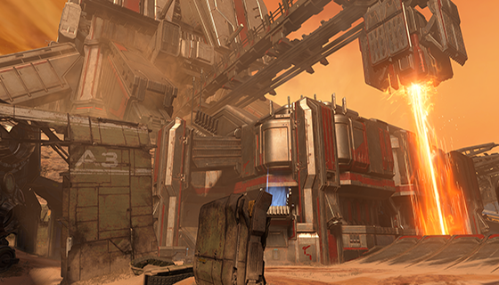             | `e6cbfe01-665b-4a8c-bf3a-d63a65a7c890` | [Breaker](https://github.com/dend/openspartan-data-snapshots/tree/main/data/maps/e6cbfe01-665b-4a8c-bf3a-d63a65a7c890) | 1 |
| 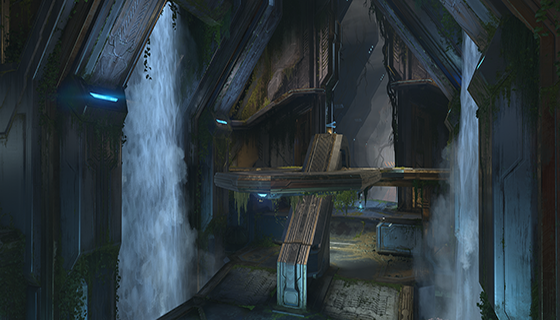           | `e859cf75-9b8a-429a-91be-2376681c8537` | [Catalyst](https://github.com/dend/openspartan-data-snapshots/tree/main/data/maps/e859cf75-9b8a-429a-91be-2376681c8537) | 1 |
| 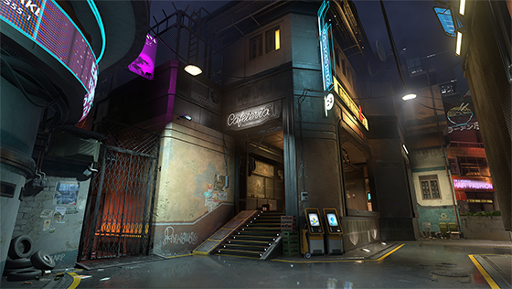             | `f0a1760f-0d4a-4bcc-ac7a-e8f9aee331dc` | [Streets](https://github.com/dend/openspartan-data-snapshots/tree/main/data/maps/f0a1760f-0d4a-4bcc-ac7a-e8f9aee331dc) | 1 |

## Game Modes

| Image | Game Mode | Available Versions |
|:----|:----|:-------------------|
| 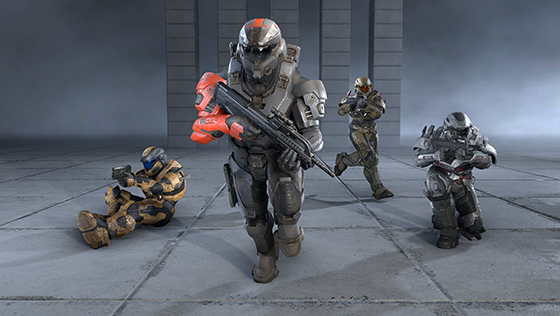 | [Ranked - Free-For-All Slayer](https://github.com/dend/openspartan-data-snapshots/tree/main/data/game_variants/02f11d91-a43b-4205-9e55-494638949522) | 1 |
| 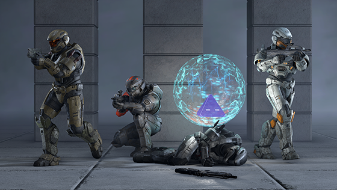 | [Ranked - Attrition](https://github.com/dend/openspartan-data-snapshots/tree/main/data/game_variants/0bc630bf-2ee3-4eae-b272-b68d4ab80be7) | 1 |
|  | [Fiesta - Strongholds](https://github.com/dend/openspartan-data-snapshots/tree/main/data/game_variants/0f4db632-f836-4c27-845f-c200b5c04df9) | 1 |
| 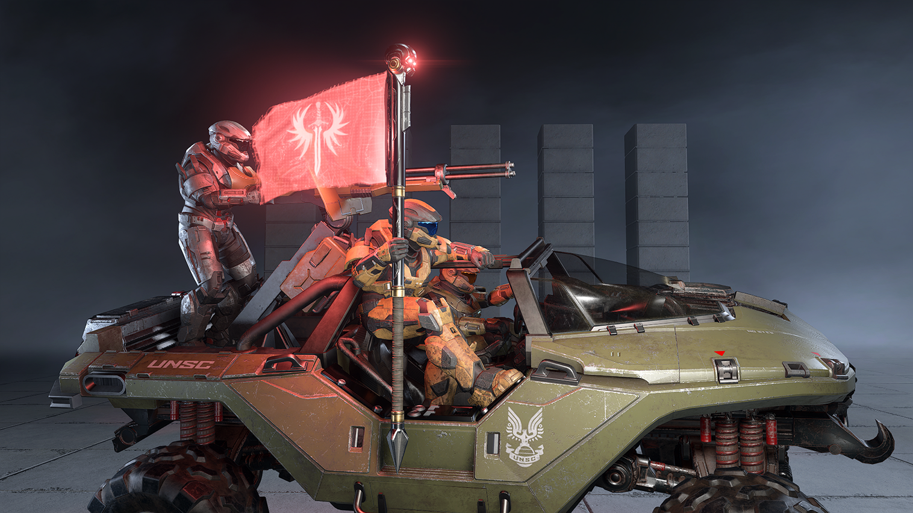 | [Big Team Battle - Capture The Flag](https://github.com/dend/openspartan-data-snapshots/tree/main/data/game_variants/1519c0cb-759d-424e-a68e-b9cb870b1e14) | 1 |
| 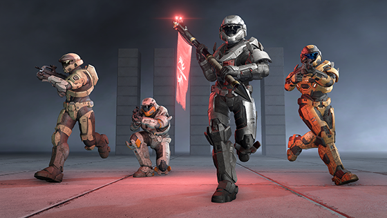 | [Ranked - One Flag Capture The Flag](https://github.com/dend/openspartan-data-snapshots/tree/main/data/game_variants/18ac247d-7f86-4a59-9b47-9e74a6384ac2) | 1 |
| 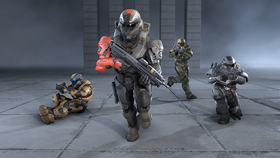 | [Arena - Slayer](https://github.com/dend/openspartan-data-snapshots/blob/main/data/game_variants/1e8cd10b-1496-423b-8699-f98f6f5db67e) | 1 |
| 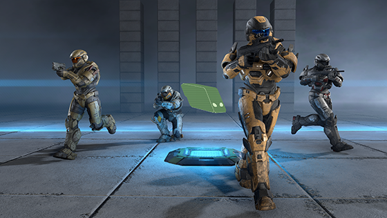 | [Ranked - Strongholds](https://github.com/dend/openspartan-data-snapshots/blob/main/data/game_variants/22b8a0eb-0d02-4eb3-8f56-5f63fc254f83) | 1 |
| 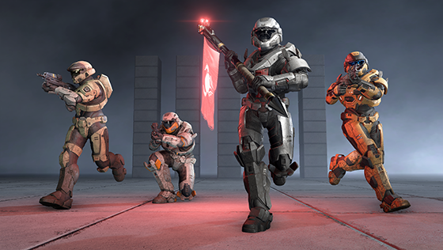 | [Arena - One Flag Capture The Flag](https://github.com/dend/openspartan-data-snapshots/tree/main/data/game_variants/29a97061-cf32-49c6-80f0-6638f5a9d0bd) | 1 |
| 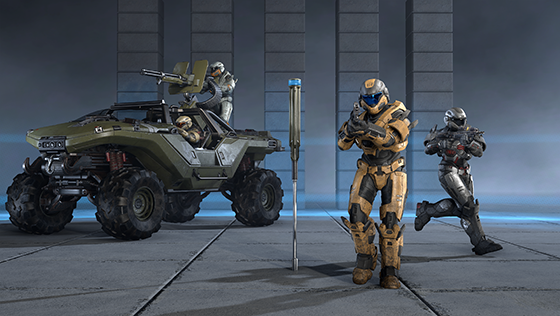 | [Big Team Battle - Total Control](https://github.com/dend/openspartan-data-snapshots/tree/main/data/game_variants/34bac2c7-b6d7-4202-b634-1d770e5247a4) | 1 |
| 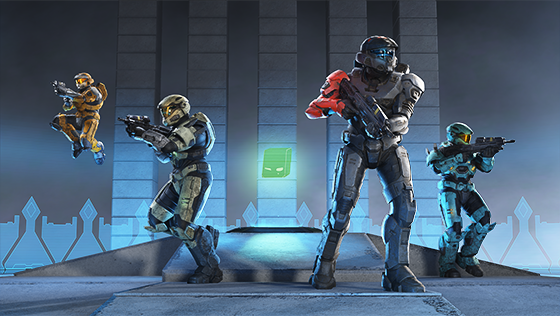 | [Arena - King of the Hill](https://github.com/dend/openspartan-data-snapshots/blob/main/data/game_variants/373f3d27-cb4c-4d7b-b6c9-7757de3c1133) | 1 |
|  | [Halo Championship Series - Free-For-All Slayer](https://github.com/dend/openspartan-data-snapshots/blob/main/data/game_variants/3909ae2f-9f59-498a-ada6-7bca46ef8086) | 1 |
| 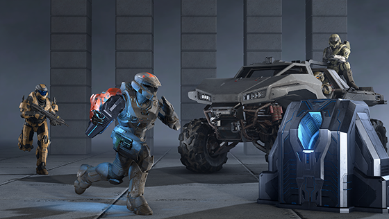 | [Big Team Battle - Stockpile](https://github.com/dend/openspartan-data-snapshots/blob/main/data/game_variants/3d614e5f-0787-405c-844e-e34c7301e750) | 1 |
| 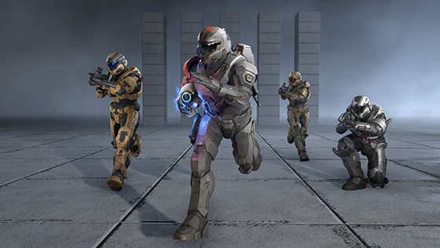 | [Arena - Free-For-All Oddball](https://github.com/dend/openspartan-data-snapshots/blob/main/data/game_variants/3fcab1bb-e43c-4f7c-bf7a-eb19f0cdb7db) | 1 |
|  | [Fiesta - Oddball](https://github.com/dend/openspartan-data-snapshots/blob/main/data/game_variants/4865915b-c24f-44c2-97ab-b8285f35708e) | 1 |
| 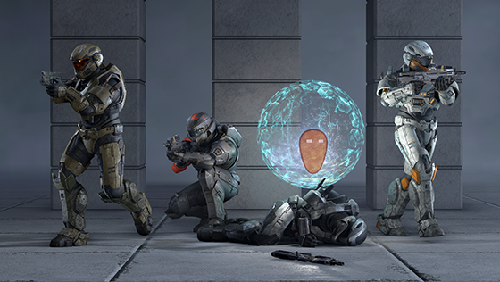 | [Arena - Attrition](https://github.com/dend/openspartan-data-snapshots/blob/main/data/game_variants/4d0f6e15-cc3f-46e0-9d06-22de6311c4cb) | 1 |
|  | [Ranked - Capture The Flag](https://github.com/dend/openspartan-data-snapshots/blob/main/data/game_variants/507191c6-a492-4331-b2ae-a172101eb23e) | 1 |
|  | [Tactical Slayer](https://github.com/dend/openspartan-data-snapshots/blob/main/data/game_variants/54d19aff-b0b4-462a-a8eb-198f3b295dee) | 1 |
| 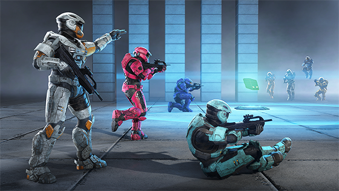 | [Ranked - Land Grab](https://github.com/dend/openspartan-data-snapshots/blob/main/data/game_variants/5cfad260-0ea2-4c49-b473-cb0b38152158) | 1 |

_Documentation for this section is in progress_

## Feedback or questions

Make sure to [open an issue](https://github.com/dend/openspartan-data-snapshots/issues).

## Disclaimer

This project is not endorsed or sponsored by Microsoft or 343 Industries. Data presented here is for purely educational and entertainment purposes, and comes with no guarantees, implied or otherwise. The accuracy of the numbers, alongside with detailed formulas used to calculate each on the Halo Infinite backend are unknown.